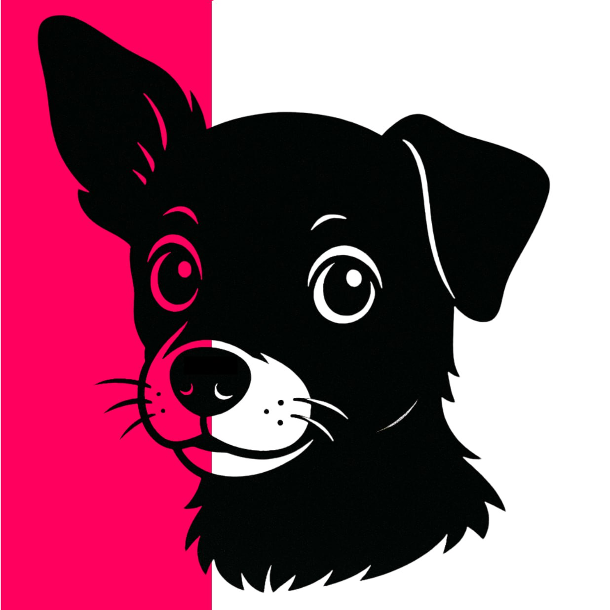

# Lucy-CLI



## Motivation

Lucy-CLI was developed out of a personal need to gain full TypeScript support for Wix Velo projects. Typically, using Wix’s GitHub integration provides JSON docs and basic type support, but I aimed for a more integrated TypeScript experience, especially for larger projects that benefit from enhanced type safety.

Lucy, my loyal dog, accompanied me during long nights working on a major project where I developed this CLI. Her companionship and resilience inspired the name "Lucy-CLI."

## What It Does

Lucy-CLI is designed to streamline the setup and management of TypeScript within Wix Velo projects, providing tools to enhance code quality and reduce development time. Here’s what it offers:

1. **ESLint Configuration**  
   - Adds ESLint with a default configuration (customizable post-init) to maintain consistent code style and prevent common errors.

2. **Wix Type Definitions**  
   - Exposes Wix type definitions located in `.wix/types/wix-code-types`, allowing direct import and access to the types for comprehensive TypeScript support.

3. **Autocomplete and Type Mapping for Page Elements**  
   - Maps Wix page elements to their respective types, so `$w('element')` calls have full TypeScript support, including autocomplete for properties and methods.

4. **Git Submodule Support**  
   - Includes support for git submodules, providing full type support within submodules and enabling the use of libraries and types across projects.

5. **Configurable Setup**  
   - After initialization, Lucy-CLI creates a `lucy-config.json` configuration file where you can modify settings, add dev packages, specify Wix packages, and configure git submodules.

---

## Commands & Options

Lucy-CLI comes with a range of commands and options to help manage your Wix Velo project. Here’s an overview:

### Commands

- **`init`**: Initializes the current folder as a Wix project, creating essential configuration files.
- **`dev`**: Starts the development environment, including setting up any required services for local development.
- **`build-prod`**: Builds the project in production mode, optimizing files for deployment.
- **`prepare`**: Re-runs initialization commands, useful for setting up a pre-configured environment.
- **`sync`**: Synchronizes the database and any dependencies or configurations necessary for the project.
- **`install`**: Installs all Wix npm packages listed in the `wixpkgs.json` file in the project directory.
- **`fix`**: Runs a fix command to resolve common issues in development or production settings.

### Options

- **`-h, help`**: Displays the help message with command descriptions.
- **`-v, version`**: Shows the current version of Lucy-CLI as defined in the project’s `package.json`.
- **`-f, force`**: Forces specific commands to execute, useful for deleting obsolete pages or initializing missing components.
- **`-l`**: Locks package versions to those specified in the configuration file during installation.

---

## Examples

Here are some example commands to get started with Lucy-CLI:

```bash
# Initialize a new Wix project
lucy-cli init

# Start the development environment
lucy-cli dev

# Synchronize database and settings
lucy-cli sync

# Install Wix npm packages from 'wixpkgs.json' with locked versions
lucy-cli install -l

# Force start the dev environment
lucy-cli dev -f

# get help
lucy-cli help

🦮 Lucy CLI Help
Usage: lucy-cli <command> [options]

Commands:
🦮 init               : Initializes the current folder as a Wix project by creating the necessary configuration files.
🦮 dev                : Starts the development environment. This includes setting up any required services for local development.
🦮 build-prod         : Builds the project in production mode, optimizing files for deployment.
🦮 prepare            : Prepares the project by re-running initialization commands. Useful for setting up a pre-configured environment.
🦮 sync               : Synchronizes the database and any dependencies or configurations necessary for the project.
🦮 install            : Installs all Wix npm packages listed in the 'wixpkgs.json' file in the project directory.
🦮 fix                : Runs a fix command to resolve common issues in development or production settings.

Options:
🦮 -h, help           : Displays this help message.
🦮 -v, version        : Displays the current version of Lucy CLI as defined in the project’s package.json.
🦮 -f, force          : Forces specific commands to execute even if they may lead to potential issues.
                      Used for functions like deleting obsolete pages or initializing missing components.
🦮 -l                 : Locks package versions to those specified in the configuration file during installation.

Examples:
🦮 lucy-cli init       : Initializes a new Wix project.
🦮 lucy-cli dev        : Starts the development environment.
🦮 lucy-cli sync       : Synchronizes database and settings.
🦮 lucy-cli install    : Installs all Wix npm packages from 'wixpkgs.json'.
🦮 lucy-cli dev -f     : Starts the dev environment with forced settings.
🦮 lucy-cli install -l : Installs Wix npm packages, respecting locked versions specified in the configuration.
